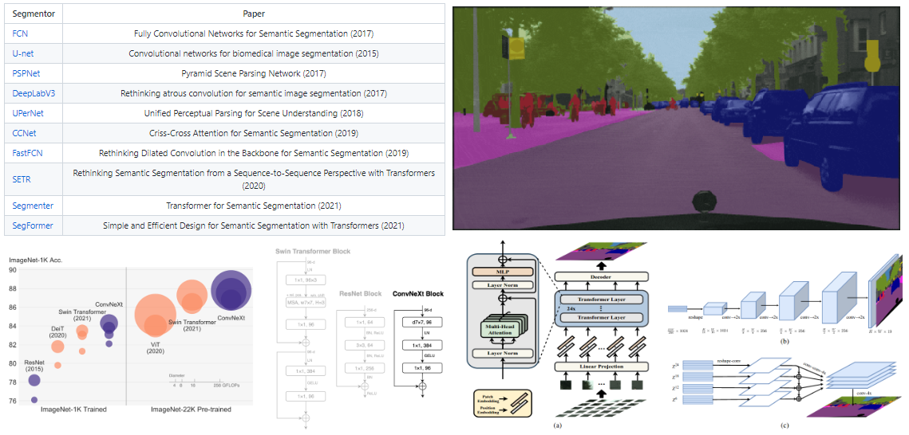
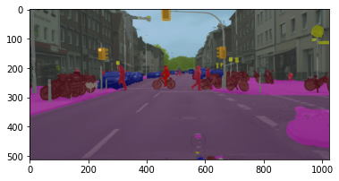
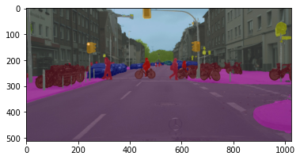
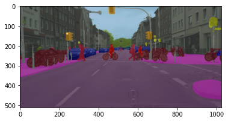
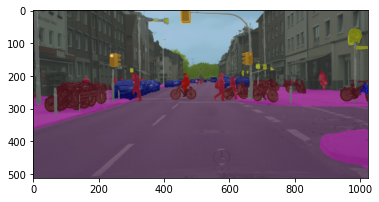
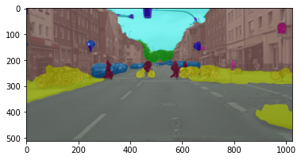
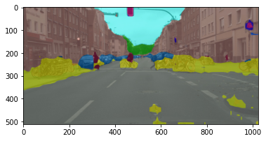
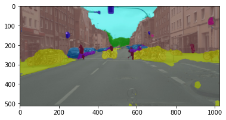
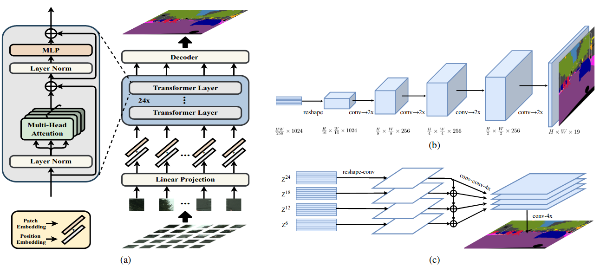

#  Semantic segmentation



Semantic image segmentation is the task of classifying each pixel in an image from a predefined set of classes.

In this tutorial, you will:
- Perform inference with 10 well-known semantic segmentors <a href="https://colab.research.google.com/drive/1WJtghM5munkksP2CZQ90fiVTYkSL3e3S?usp=sharing" target="_parent"></a>
- Fine tune semantic segmentors on a custom dataset <a href="https://colab.research.google.com/drive/1e6QgCHvfcm54pSSv0Cf4GiUlpNPXoMxv?usp=sharing" target="_parent"></a>
- Design and train your own semantic segmentation model <a href="https://colab.research.google.com/drive/1EX9uUhikpWkgO-E0Eews0mJaDPbQp6yl?usp=sharing" target="_parent"></a>


This work is based on [MMSegmentation](https://github.com/open-mmlab/mmsegmentation): [OpenMMLab](https://github.com/open-mmlab) segmentation toolbox and benchmark.


## 10 Semantic segmentors

| Segmentor     | Paper         |
| ------------- |:-------------:|
| [FCN](https://arxiv.org/abs/1411.4038)    | Fully Convolutional Networks for Semantic Segmentation (2017)
| [U-net](https://arxiv.org/abs/1505.04597)    | Convolutional networks for biomedical image segmentation (2015)
| [PSPNet](https://arxiv.org/abs/1612.01105)    | Pyramid Scene Parsing Network (2017)
| [DeepLabV3](https://arxiv.org/abs/1706.05587)    | Rethinking atrous convolution for semantic image segmentation (2017)
| [UPerNet](https://arxiv.org/pdf/1807.10221.pdf)    | Unified Perceptual Parsing for Scene Understanding (2018)
| [CCNet](https://arxiv.org/abs/1811.11721)    | Criss-Cross Attention for Semantic Segmentation (2019)
| [FastFCN](https://arxiv.org/abs/1903.11816)    | Rethinking Dilated Convolution in the Backbone for Semantic Segmentation (2019)
| [SETR](https://arxiv.org/abs/2012.15840)    | Rethinking Semantic Segmentation from a Sequence-to-Sequence Perspective with Transformers (2020)
| [Segmenter](https://arxiv.org/abs/2105.05633)    | Transformer for Semantic Segmentation (2021)
| [SegFormer](https://arxiv.org/abs/2105.15203)    | Simple and Efficient Design for Semantic Segmentation with Transformers (2021)


-----

## Perform inference 

<a href="https://colab.research.google.com/drive/1WJtghM5munkksP2CZQ90fiVTYkSL3e3S?usp=sharing" target="_parent"></a>

Here is how to load a pretrained model, perfrom inference and vizualize the results.

```
model = init_segmentor(config, checkpoint, device='cuda:0')
result = inference_segmentor(model, img)
model.show_result(img, result, out_file='result.jpg', win_name=m_name)
```

### Results

| Segmentor     | Result         |
| ------------- |:-------------:|
| [FCN](https://arxiv.org/abs/1411.4038)    | 
| [U-net](https://arxiv.org/abs/1505.04597)    | 
| [PSPNet](https://arxiv.org/abs/1612.01105)    | 
| [DeepLabV3](https://arxiv.org/abs/1706.05587)    | 
| [UPerNet](https://arxiv.org/pdf/1807.10221.pdf)    | 
| [CCNet](https://arxiv.org/abs/1811.11721)    | 
| [FastFCN](https://arxiv.org/abs/1903.11816)    | 
| [SETR](https://arxiv.org/abs/2012.15840)    | 
| [Segmenter](https://arxiv.org/abs/2105.05633)    | 
| [SegFormer](https://arxiv.org/abs/2105.15203)    | 


-----

## Fine tune semantic segmentors on a custom dataset

<a href="https://colab.research.google.com/drive/1e6QgCHvfcm54pSSv0Cf4GiUlpNPXoMxv?usp=sharing" target="_parent"></a>

- Select a semantic segmentation model: **SEgmentation TRansformer** [SETR](https://arxiv.org/abs/2012.15840)
- Add a new dataset class: [Scene Understanding Datasets](http://dags.stanford.edu/projects/scenedataset.html)
- Create a config file.
- Conduct training and evaluation.




-----

## Design and train your own semantic segmentor

<a href="https://colab.research.google.com/drive/1EX9uUhikpWkgO-E0Eews0mJaDPbQp6yl?usp=sharing" target="_parent"></a>

- Select a semantic segmentation model: [UPerNet](https://arxiv.org/pdf/1807.10221.pdf) Unified Perceptual Parsing for Scene Understanding
- Replabe the ResNet backbone with a new one: [ConvNeXt](https://arxiv.org/pdf/2201.03545.pdf) A ConvNet for the 2020s
- Config the heads.
- Add a new dataset class: [Scene Understanding Datasets](http://dags.stanford.edu/projects/scenedataset.html)
- Conduct training and evaluation.


Regards! 

